# Kravenox: O Reino Quebrado — estado atual do jogo

> A tabela de capítulos é aproximada: alguns capítulos se espalham por mais de um lugar.
>
> Documento para análise externa. Retrato fiel de como o jogo está hoje (08/10/2026), o que já existe,
> o que ainda é simples e o que está planejado. O objetivo é receber sugestões de **inovações,
> pontos cegos e novidades**.

**Jogar agora (navegador, celular ou PC, grátis):** https://the3dig.github.io/kravenox-jogar/rpg/
**Código:** https://github.com/The3dig/kravenox-jogar

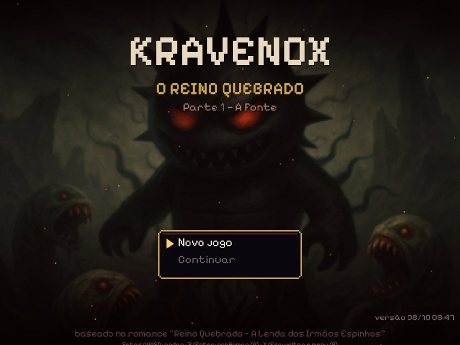

---

## 1. O que é

- **Gênero:** RPG por turnos no estilo **Phantasy Star** (exploração vista de cima, masmorras em primeira
  pessoa, batalhas por turnos), com batalha em arena isométrica inspirada em **Super Mario RPG**.
- **Origem:** o Kravenox nasceu de um **desenho de caneta azul numa brincadeira de escola, há 45 anos**.
  Virou o romance *"Reino Quebrado — A Lenda dos Irmãos Espinhos"*, e agora vira jogo.
- **Escopo atual:** **Parte 1 — "A Fonte"**, que cobre os **capítulos 1 a 13** do livro. A Parte 2 ("O Reino
  em Guerra") cobrirá do capítulo 14 em diante, incluindo o encontro com o pai.
- **Plataforma:** página web (HTML5 + JavaScript puro, sem motor externo), publicada no GitHub Pages.
  Funciona no celular com controle na tela (direcional + A/B) e no PC com teclado.
- **Filosofia de design pedida pelo autor:** *"nada de facilidades dos jogos atuais"*. Sem minimapa com
  marcação de saída, sem setas indicando o caminho, sem mão na roda. A melhoria vem por **beleza, clima e
  fidelidade ao livro**.
- **Projeto irmão:** *Cratera do Cisma*, um jogo de ação estilo Vampire Survivors com o Kravenox, feito em
  Godot. Fica escondido dentro do RPG como easter egg.

---

## 2. História coberta (Parte 1)

| Cap. | Título | Onde acontece | Destaques |
|---|---|---|---|
| 1 | O Despertar no Reino Quebrado | Abismo Carmesim (masmorra) | Cena do despertar (cristal pulsa, racha e explode; os olhos se abrem); chefe: Larva-Mãe |
| 2 | Ecos do Cisma | Reino / Vila Sem Nome | Primeiras memórias; a Vila vazia |
| 3 | As Sentinelas | Vila | Chefe: Sentinela sem Rosto |
| 4 | A Vila Sem Nome | Vila / Floresta Morta | Mulher das Raízes, fragmento da Essência; chefe: Guardião Branco |
| 5 | A Primeira Raiz | Floresta / Templo | Entrada no Templo da Primeira Raiz |
| 6 | O Sangue dos Irmãos | Templo da Primeira Raiz | Reencontro com **Thornox**; chefe: Raiz Negra |
| 7 | A Coisa que Dormia | Câmara dos Cristais | Chefes: Arauto e A Coisa que Dormia |
| 8 | Os Sinos do Vazio | Vale dos Mortos | Ponte dos Mortos; chefe: O Primeiro Guardião |
| 9 | O Abismo entre os Irmãos | Vale dos Mortos | A queda; separação dos irmãos |
| 10 | A Filha Esquecida | Cidade Submersa | Encontro com **Lyra** |
| 11 | O Sétimo Sino | Cidade Submersa | Rio das memórias, as três portas |
| 12 | A Escolha | A Fonte | — |
| 13 | A Quarta Essência | A Fonte | Chefes finais (A Primeira Consciência / A Mãe Esquecida) e a **cena cinematográfica da despedida da mãe**, fiel ao texto |

São **55 roteiros de cena** no total (diálogos, visões de memória, cenas de chefe, eventos de mapa).

---

## 3. Como se joga

### 3.1 Abertura
Prólogo narrado, depois a cena do **despertar em primeira pessoa**: o cristal pulsa junto com batidas de
coração, racha e explode. As pálpebras se abrem (tela preta que se abre em faixa), ele pisca e olha em volta
da masmorra, e então vem o primeiro pensamento: *"Fome."*

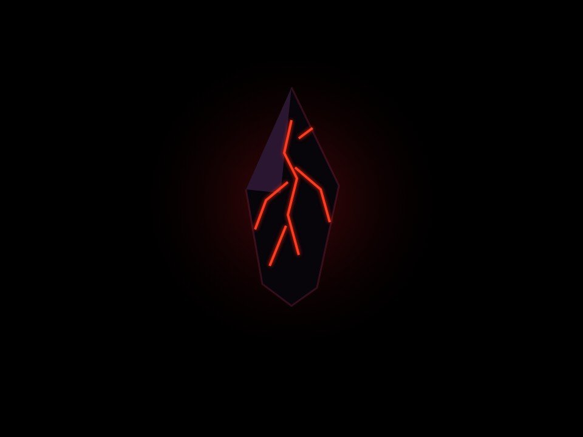
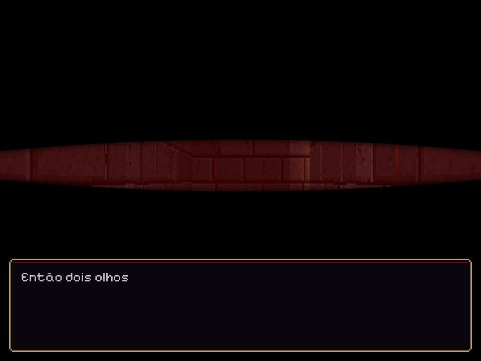

### 3.2 Masmorras em primeira pessoa
- Motor de **raycasting** (estilo Phantasy Star/Wolfenstein) com texturas de pedra procedurais, teto, chão,
  tochas que tremulam, névoa de distância e giro suave.
- 4 masmorras: **Abismo Carmesim** (pedra cinza com veias vermelhas), **Templo da Primeira Raiz**,
  **Câmara dos Cristais** e **Cidade Submersa**. Cada uma com tema, música, baús, eventos e encontros próprios.
- Sem mapa automático, de propósito.

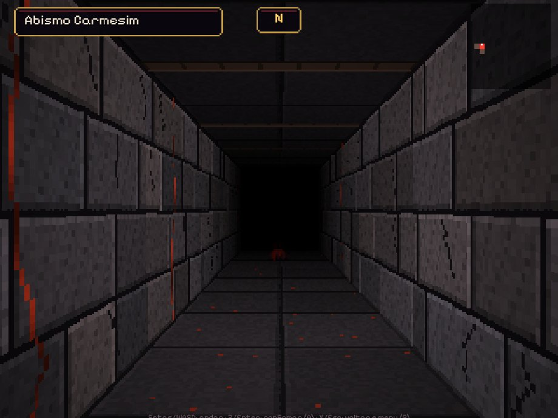

### 3.3 Exploração vista de cima
- Mapas: **Reino Quebrado** (mundo), **Vila Sem Nome**, **Casa da Luz Dourada** e **Vale dos Mortos**.
- O terreno é **pintado pixel a pixel**: montanhas em pedregulhos com picos e penhascos, fendas com paredes e
  brasas subindo, estradas de bordas irregulares, calçamento de pedra, casas de enxaimel com chaminé e fumaça,
  árvores retorcidas, cristais que pulsam, lápides variadas.
- Camada viva: cinzas caindo, sombras de nuvens, luzes que tremulam, vagalumes e espíritos.
- Encontros aleatórios por tipo de terreno.

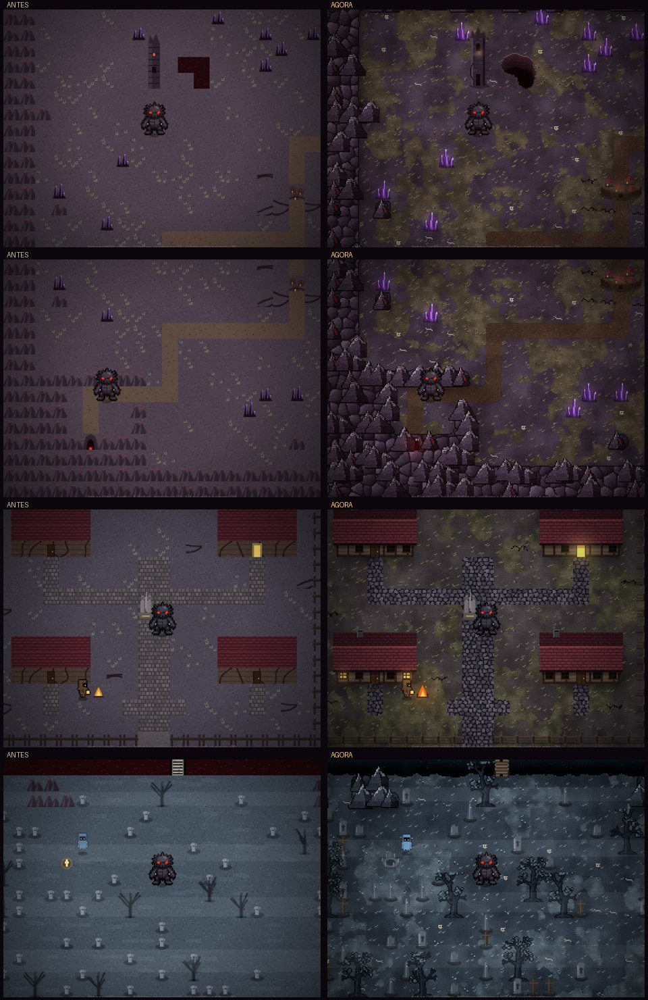
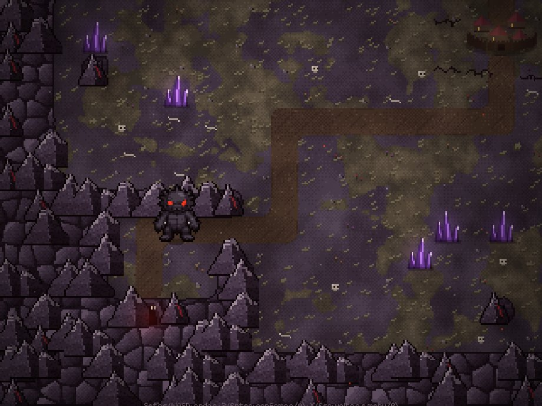
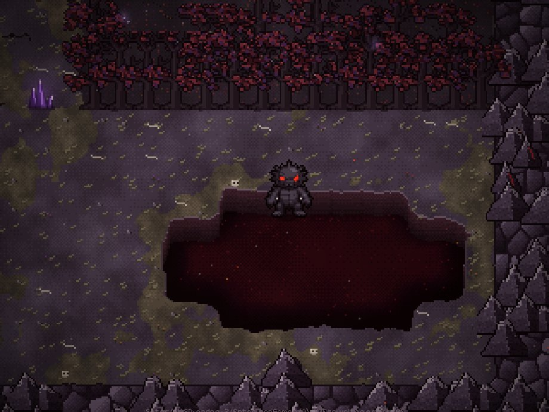
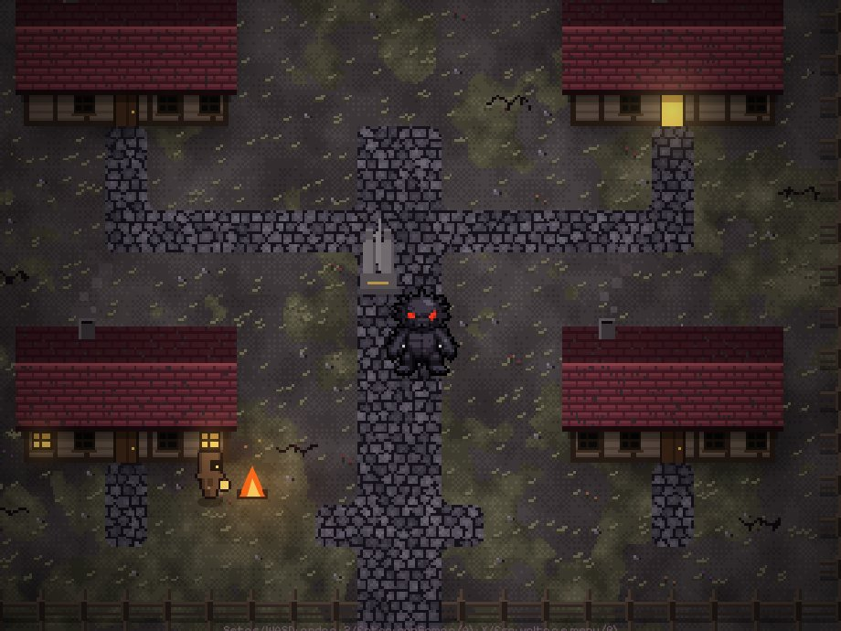
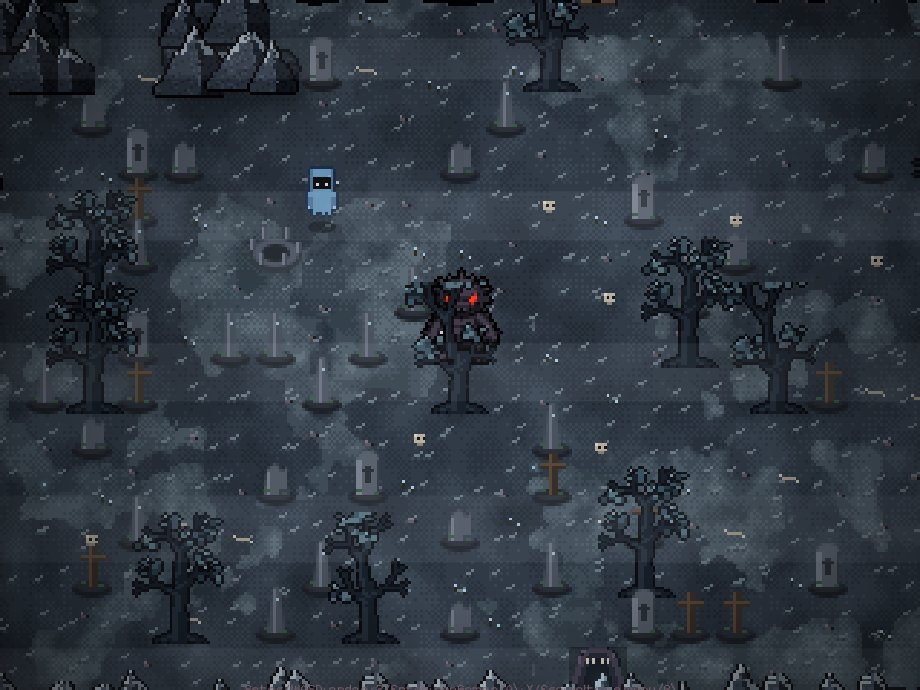

### 3.4 Batalha
- **Por turnos**, com menu Atacar / Técnica / Item / Defender / Fugir.
- **Arena isométrica** (estilo Super Mario RPG): piso em losangos e, em lugar fechado, duas paredes formando o
  canto da sala com tochas. Os inimigos ficam numa diagonal no alto à esquerda, virados para o grupo; os
  heróis ficam embaixo à direita.
- Os heróis **correm até o inimigo** para atacar e voltam; ao usar técnica dão um passo à frente com aura;
  ao levar dano são empurrados para trás e piscam; os números de dano e cura aparecem sobre cada um; na
  vitória o grupo pula.
- Os inimigos morrem se **desfazendo em pixels**. Efeitos de técnica usam as artes desenhadas pelo autor.
- **Velocidade:** 1x (padrão, mais calma) ou **2x** (rápida), escolhida no menu.

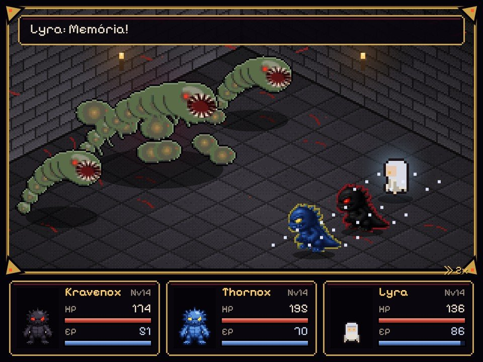
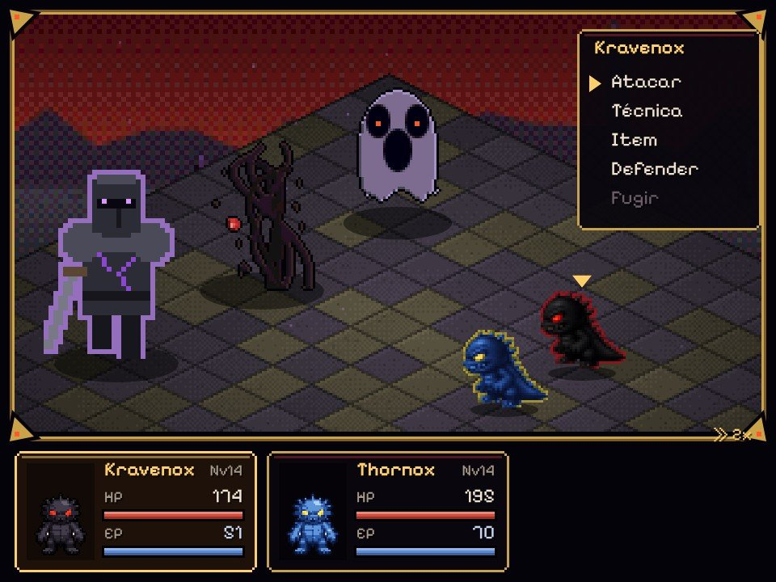
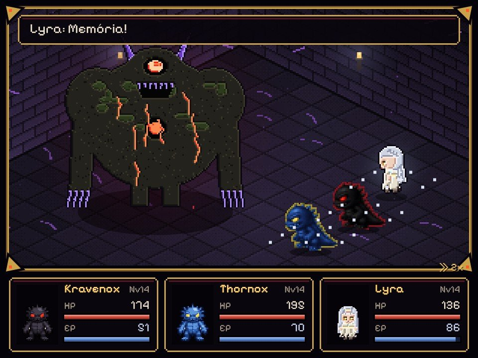

### 3.5 Personagens jogáveis

| Herói | Papel | Técnicas (nível em que aprende) |
|---|---|---|
| **Kravenox** | ataque físico e sombrio | Espinhos (1), Espinhos Vorazes (4), Modo Fúria (6), Fome do Abismo (7), Esmagamento (9), Raio da Essência (11), Pelas Sombras (13), Espinhos Prateados (história) |
| **Thornox** (irmão gêmeo) | luz, cura e proteção | Luz Dourada (1), Rajada Dourada (1), Barreira de Luz (6), Pedras Flutuantes (9), Aurora (12) |
| **Lyra** | memória e suporte | Memória (1), Barreira de Memórias (1), Eco da Vida (1), Lembrança Dourada (14) |

O Thornox usa o **mesmo corpo do Kravenox, em azul e dourado**, e brilha em dourado ao usar técnicas.
No **Modo Fúria**, o Kravenox vira a arte "em chamas" desenhada pelo autor.

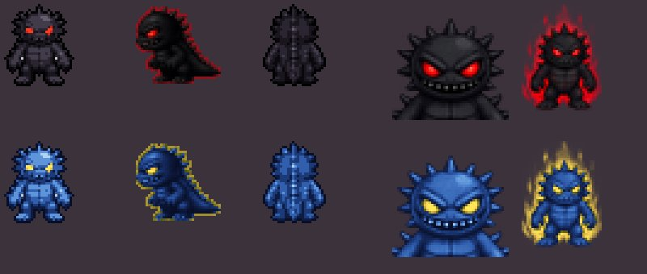

### 3.6 Progressão e economia
- **Níveis** com curva de experiência; atributos HP, EP, Ataque, Defesa, Magia e Agilidade.
- **Moeda:** fragmentos de cristal deixados pelos inimigos.
- **Itens (6):** Seiva Viva, Néctar Dourado, Cristal de Essência, Raiz da Vida, Lágrima da Fonte e Véu de Névoa.
- **Equipamentos (14):** armas próprias de cada herói e armaduras compartilhadas, compradas do **Mascate de
  Cinzas** ou achadas em baús.
- **Inimigos:** 27, entre eles **10 chefes**. A dificuldade foi equilibrada por simulação de batalhas.
- **Salvar:** no menu ou nos santuários (que também curam). O jogo salva sozinho ao fechar o navegador.
  É um único espaço de save, guardado no próprio navegador.

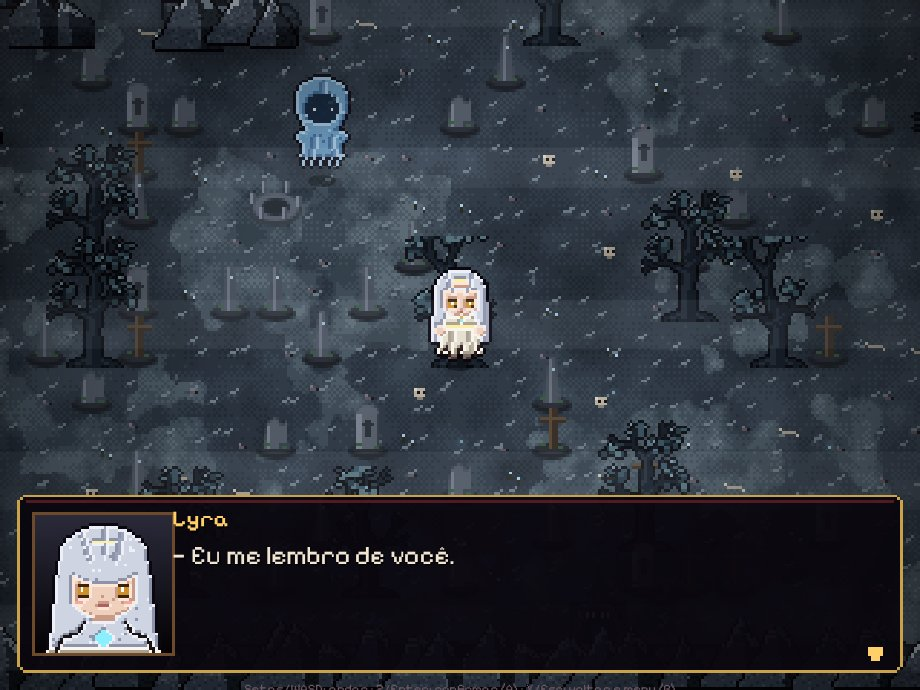
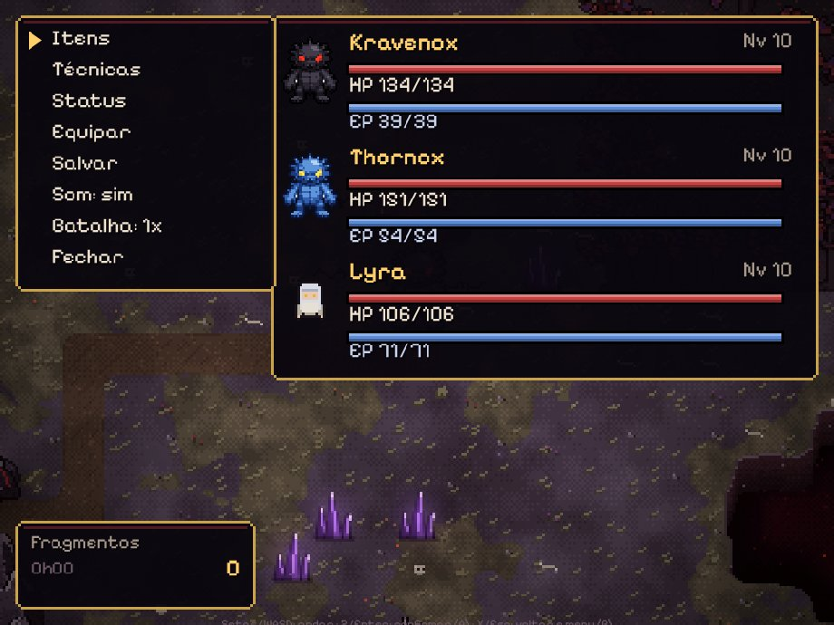

---

## 4. Cenas cinematográficas
Há um sistema de "cinema" dentro do jogo, com faixas pretas, atores, silhuetas com brilho, raios de luz,
raízes, partículas e legendas.
- **Cap. 1:** o despertar.
- **Cap. 13:** a **despedida da mãe**, fiel ao texto do livro. Os três irmãos aparecem de costas, a Essência
  sai de cada um em raios até a mãe, as raízes se quebram e o corpo dela vira partículas douradas.

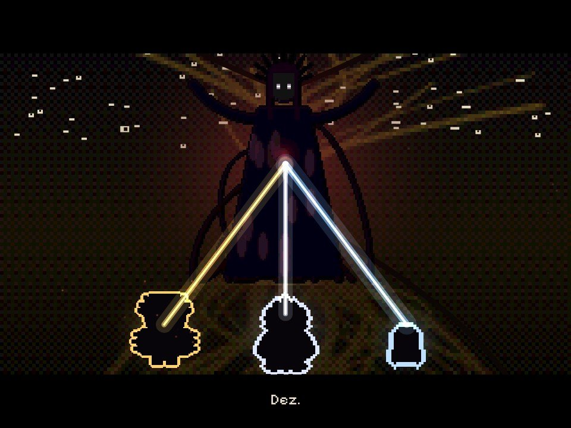
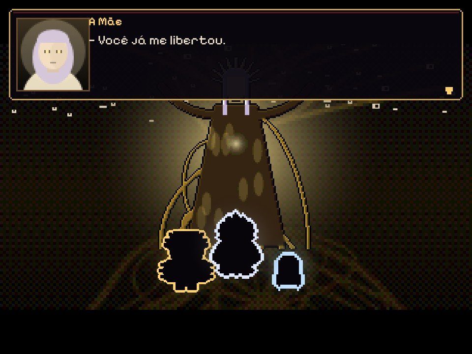

---

## 5. Som
- **16 trilhas originais** compostas para o jogo e renderizadas como arquivos de áudio (coral, cordas,
  guitarras distorcidas, piano, harpa, flauta, metais, bateria), em loop sem emenda audível.
- A linha geral é **metal ópera** no estilo Avantasia nas partes épicas (título, chefes, batalha final) e
  música orquestral ou intimista no resto: valsa triste na Vila, coral no Vale, caixinha de música nas
  memórias, piano na despedida.
- Há um **leitmotiv do Kravenox** (Ré–Fá–Lá–Sol#–Lá–Fá–Mi–Ré) que volta no título e nos chefes.
- Efeitos sonoros sintetizados (golpes, espinhos, luz, sinos, batida de coração, rachaduras…).
- No iPhone, o áudio volta sozinho depois que você sai do jogo e retorna.

---

## 6. Vídeos
- **Vídeo de abertura** (85 s), gravado do próprio jogo com a trilha nova. Mostra o desenho de escola, o
  despertar, o mapa, a masmorra e as batalhas. **Passa sozinho depois de 25 s parado na tela título**;
  qualquer toque volta ao menu.
- **Trailer com metal ópera** e **filme do Cap. 13**, feitos antes das últimas melhorias visuais.

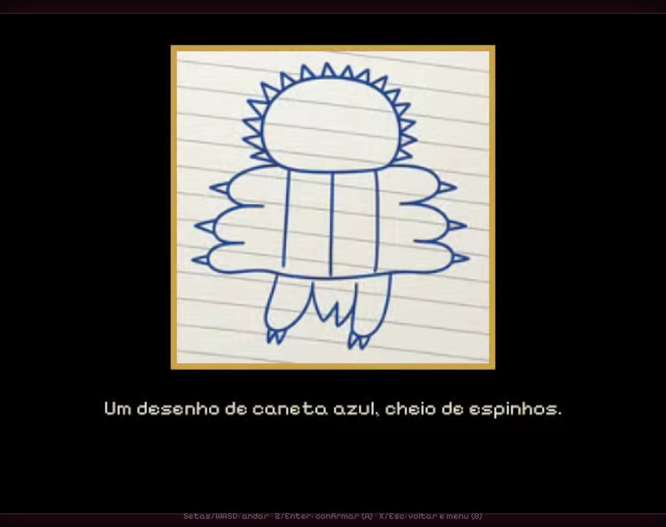

---

## 7. Easter eggs
1. **Desenho antigo:** numa casa da vila há o desenho original de caneta azul.
2. **Cratera do Cisma:** na grande cratera do Reino dá para descer e abrir o outro jogo (o Vampire Survivors
   do Kravenox).
3. **Reflexo do futuro:** olhando a fenda ao lado da torre, o reflexo pisca sozinho e mostra o **Kravenox
   evoluído de armadura**, a forma que ele terá perto do final da Parte 2.
4. **Estatueta azul do Thornox:** numa casa da vila (a foto da estatueta real do autor).
5. **Túmulo do Kravenox de lápis:** no Vale: *"Ele nunca morre. Só muda de mundo."*
6. **Segredo do Mascate:** na 7ª conversa ele conta que, em outro mundo, uma criança desenhou o Kravenox
   num caderno.
7. **Modo Caderno:** ↑↑↓↓←→←→ B na tela título deixa o jogo inteiro em caneta azul sobre papel.
8. **A torre:** de vez em quando, um olho aparece na janela.

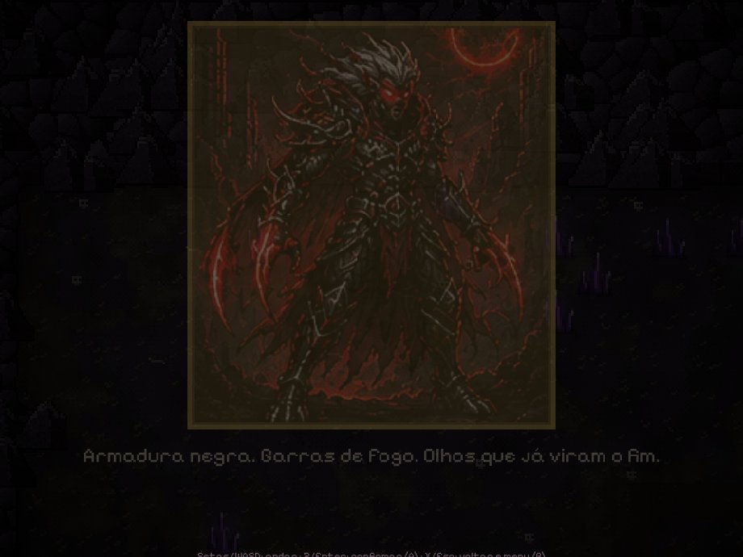
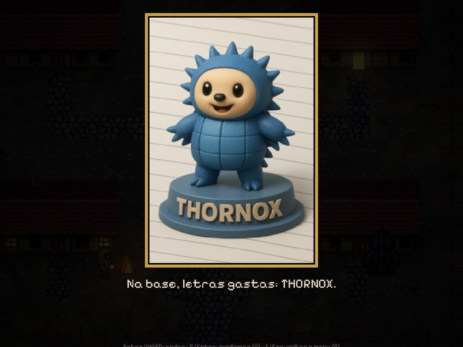
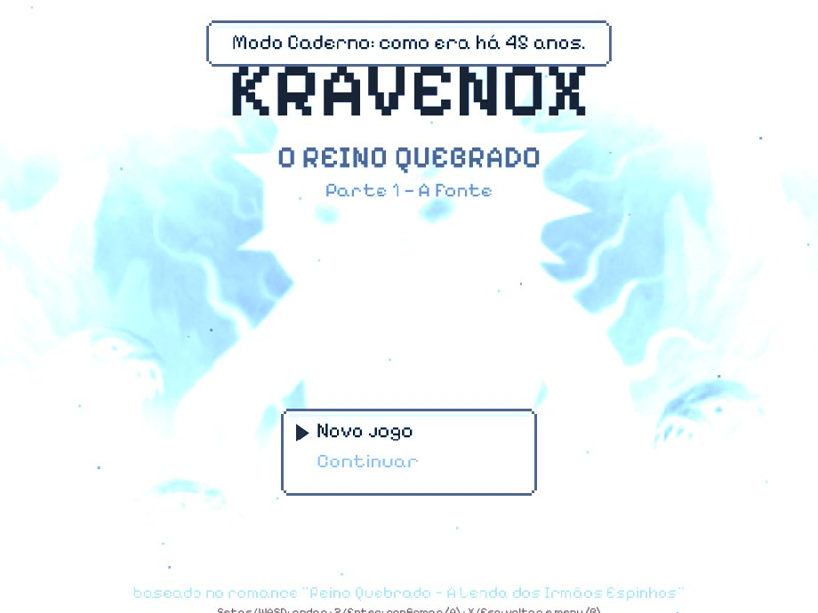

---

## 8. Arte
- **Do autor:** sprites do Kravenox (4 direções, passos de lado vindos da Cratera do Cisma, Modo Fúria,
  versão prateada), retratos, a pintura da tela título, efeitos de golpe (garras, orbe, raio, explosão,
  espinhos), a Sentinela, o desenho original de escola, a estatueta do Thornox e o Kravenox de armadura.
- **Gerada por código:** terreno, construções, árvores, cristais, tiles de masmorra, a maioria dos inimigos
  (com filtro de pixel art), os NPCs (Lyra, Mascate, Mulher das Raízes, espírito…) e os cenários de batalha.

---

## 9. Conveniências que existem (poucas, de propósito)
- O jogo **se atualiza sozinho** quando sai versão nova; salva antes de recarregar.
- Velocidade de batalha 1x/2x.
- Liga/desliga do som.
- Funciona no celular como app (dá para "Adicionar à Tela de Início").

---

## 10. Limitações conhecidas e pontos honestos
- **Ninguém além do autor e do filho jogou de verdade.** A história inteira é testada por um robô que joga
  do começo ao fim a cada mudança (sem erros), mas isso não mede diversão, ritmo nem dificuldade sentida.
  **Não temos medida do tempo de jogo de uma pessoa.**
- **Lyra e os NPCs** ainda são sprites simples gerados por código, sem arte própria como o Kravenox e o Thornox.
- A maioria dos **inimigos** é gerada por código; só a Sentinela usa arte do autor.
- O mapa do mundo é **um só** (40×30 tiles), mais Vila, Casa e Vale. Não há mundo aberto grande.
- **Não há missões paralelas**, colecionáveis com recompensa, bestiário, diário ou mapa.
- Um único espaço de save, guardado no navegador (trocar de aparelho perde o progresso).
- Sem opções de acessibilidade (tamanho de texto, cores, legendas de som).
- Sem dublagem (todo diálogo é texto).
- As músicas são sintetizadas por computador; soam bem, mas não como uma gravação de orquestra ou banda real.

---

## 11. Planos já combinados
- **Parte 2** (capítulos 14 em diante) quando o livro completo chegar:
  - **encontro com o pai** como cena cinematográfica forte (caps. 15 e 28–29);
  - **Kravenox evoluído de armadura** perto do final;
  - mais cinematográficas a cada momento marcante.
- **Mundo expandido:** existe uma planilha do autor com o universo do jogo, com a ideia de mundo aberto e
  masmorras opcionais, possivelmente em **Godot**.
- **Filme medieval de ~2h30** ao final de tudo, para publicar em plataforma de vídeo.
- Jogo pensado para durar **horas** até o final.

---

## 12. Perguntas para a análise externa
1. O que falta para a **sensação de jogar** (ritmo, desafio, recompensa) ficar no nível de um RPG clássico?
2. Que **sistemas** valeriam a pena sem quebrar a regra de "nada de facilidades modernas" (ex.: segredos,
   chefes opcionais, colecionáveis, escolhas com consequência)?
3. Como aproveitar melhor a **relação entre os irmãos gêmeos** (Kravenox nas sombras, Thornox na luz)
   na mecânica — por exemplo, golpes combinados ou momentos em que só um deles pode agir?
4. Ideias de **cinematográficas** e momentos marcantes para a Parte 2.
5. O que tornaria o jogo **compartilhável** (trailer, redes sociais, comunidade, versão de loja)?
6. Pontos cegos: acessibilidade, salvamento na nuvem, tradução, desempenho em celulares fracos.
7. Como contar a história de origem (o desenho de escola de 45 anos atrás) de forma ainda mais forte.

---

## Ficha técnica (resumo)
- HTML5 Canvas 320×240 ampliado, fonte Pixelify Sans, JavaScript puro (~5.500 linhas).
- Masmorras por raycasting; mundo pré-renderizado com ruído procedural; batalha isométrica.
- Áudio: trilhas `.m4a`/`.ogg` com loop exato e reserva em chiptune via WebAudio.
- Teste automático que joga a história inteira (Playwright).
- Hospedagem: GitHub Pages (~65 MB no total, bem abaixo do limite de 1 GB).
